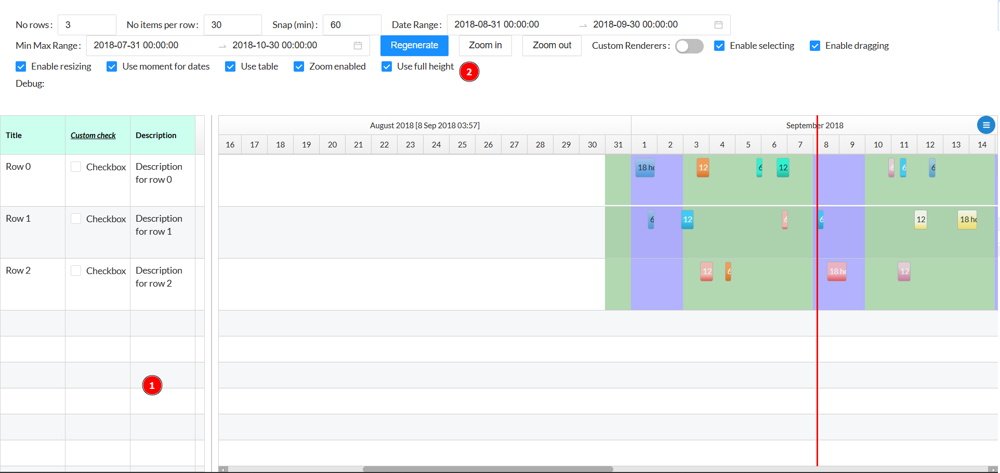

# Featurebook > FullHeightPropsTad.md
Go to [Featurebook > Index](../FEATUREBOOK.md)

<table>
<tr><td> 

`@Scenario` `_quickInstructions()`  
</td></tr>
<tr><td>

 
 
 1) Empty lines, without data
 2) Toggle the **fullHeight** props
</td></tr>
</table>

<table>
<tr><td> 

`@Scenario` `whenFullHeightProps()`  
</td></tr>
<tr><td>

 GIVEN lines height smaller than screen height
 
 WHEN1 **fullHeight** props is false
 
 THEN1 the gantt height = time bar height + lines height
 
 WHEN2 **fullHeight** props is false
 
 THEN2 the gantt height = the screen height

</td></tr>
</table>
