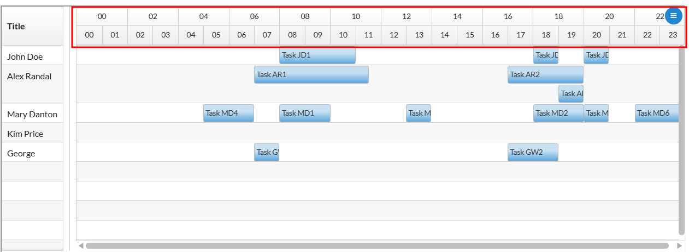
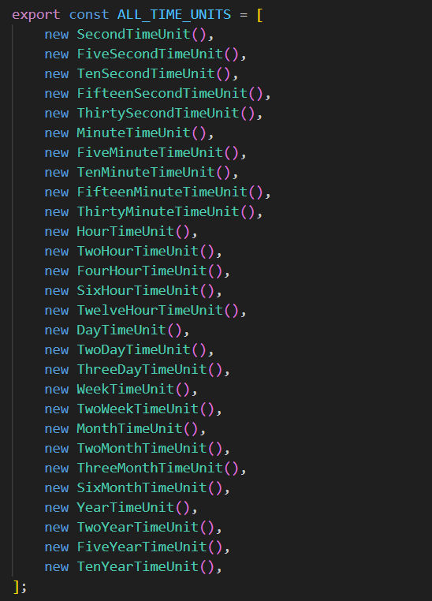
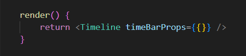
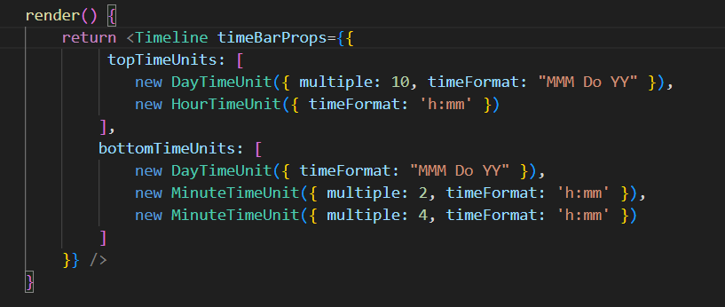

# Featurebook > TimeBarTad.md
Go to [Featurebook > Index](../FEATUREBOOK.md)

## TOC

* [`@Scenario` `_quickInstructions()`](#_quickInstructions)

## Scenarios

<table>
<tr><td> 

`@Scenario` `_quickInstructions()` 
</td></tr>
<tr><td>

The `TimeBar` component displays time intervals across two distinct header rows (top and bottom).

**Note**: The 2nd row `always` has a smaller time unit (interval) than the top row.

## Available Time Units:

## Default Activation:
By default, both rows automatically calculate and select the optimal time unit based on the current view zoom level.

## Customization:
Can explicitly configure the time units, formatting, and multipliers for both the top and bottom rows using `timeBarProps`.

</td></tr>
</table>
